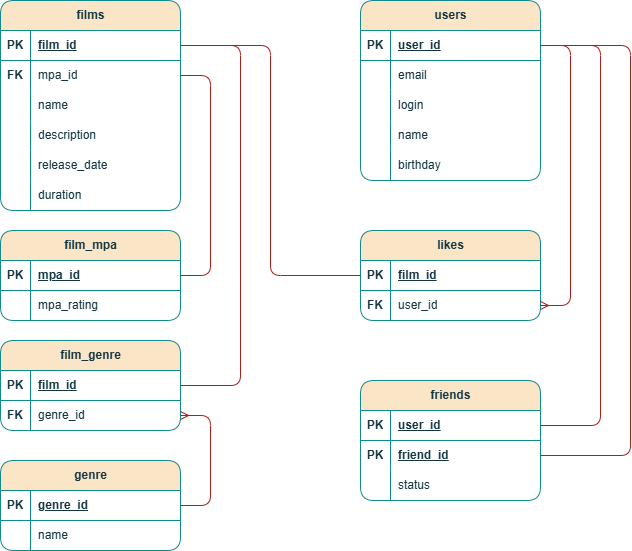

# java-filmorate

## Схема базы данных

### Пояснение к схеме

База данных спроектирована для управления каталогом фильмов и взаимодействия между пользователями. Основные таблицы:

* `films` — хранит данные о фильмах;
* `users` — хранит данные о пользователях;
* `friends` — хранит статус дружбы у пользователей;
* `like` — хранит отметки «Нравится» для фильма;
* `film_mpa` — хранит рейтинг фильмов.
* `film_genre` — хранит жанры фильма.
